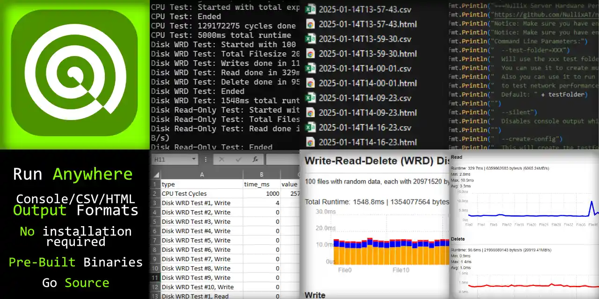

## Nullix Server Hardware Performance Test Tool (NSHPTT)
A simple tool to test raw performance of any server, pc or machine. It features CPU and Disk stress tests and can/should be used to compare multiple machines to find bottlenecks.

I created this because after a huge migration from one hosting company/location to another with tons of virtual machines, there was a lot of performance issues at the new location, which where incredible hard to nail down. This tool was developed to find this issues and have reasonable, reproducable and comparable results.

## Features

- Supported on almost every platform and architecture with pre-built binaries or go source
- CPU Speed Test
- Disk Speed Test
- Results are logged in several ways: In the console, as a viewable HTML file with charts and as a CSV file to be machine readable
- Repeated tests to generate an average of multiple test runs into one result file, with `--run=xx`. Each single data point still visible in HTML and CSV file.

## How it works

The tool run several tests, stressing different parts of your machine. The machine will be stressed for some time. Just run the tests on a testmachine before and tweak the settings before going to your production environment.

- CPU Tests:  The test just calculates square-root of random floats as often as it can, for a set amount of time.
- Disk Write-Read-Delete Speed Test: Files are written, readed and deleted with random bytes during the test. Size, location and number of files can be configured.
- Disk Read-Only Test: Only read files that are generated with random bytes before running the read tests. Size, location and number of files can be configured.

## How it not works

You may tend to compare this tool to other HDD test tools (Diskmark, fio, etc..) or CPU test tools (Prime95, etc...). NSHPTT has it's own way of testing. It's just one more tool for you to find issues on your machine. Our tool simulate more a real application behaviour rather then raw hardware penetration.
Our CPU test for example doesn't stress all cores or don't even a single core to 100%. It just do random calculations in a single program as fast as it can, as probably real world applications would do.

Also the disk tests work differently. Our tests just write/read/delete files on disk with normal application code. We let OS and the programming language do all this things for us. This means, OS disk cache may come into place, application overhead my come into place, etc... All stuff that a real world application also do and have to deal with. You cannot change read/write block size or any other advanced IO options. 

## Usage Pre-Built Binaries
Download a pre-built binary from "Releases" for your OS architecture and run it via command-line. The man page will show up that lists you all possible usages.

    # linux server example - start in a new empty folder    
    wget https://github.com/NullixAT/nullix-server-hardware-performance-test-tool/releases/latest/download/nshptt_linux_amd64
    chmod +x nshptt_linux_amd64
    ./nshptt_linux_amd64 --create-config
    ./nshptt_linux_amd64 --create-test-files
    ./nshptt_linux_amd64 --run

    # windows example (terminal, not powershell) - start in a new empty folder
    curl -O -L https://github.com/NullixAT/nullix-server-hardware-performance-test-tool/releases/latest/download/nshptt_win_amd64.exe
    .\nshptt_win_amd64.exe --create-config
    .\nshptt_win_amd64.exe --create-test-files
    .\nshptt_win_amd64.exe --run

> Notice: The pre-compiled binaries can probably be detected by anti-virus software, as they are not signed and AV heuristics maybe struggle with that.
If you don't trust the pre-compiled binaries, feel free to directly use the `Usage directly with GO` variant. You can review and inspect the script before you run it.

## Usage directly with Golang

    go run tool.go --create-config
    go run tool.go --create-test-files
    go run tool.go --run

## CSV Format
The result CSV contains `type;time_microseconds;value;timestamp`.
- type: Type of test
- time_microseconds: The time used for actually executing the only test-revelant part, excluding time to setup the test before it can run (file creation, logging, etc...)
- value: The value for values other than time_, for example the CPU cycles
- timestamp: The timestamp of when the actual CSV row has been written

## HTML Format
The result HTML contains an easy viewable page with charts to make it easier for humans to read.

## Development

Always create an `issue` at github before you start changing things that you want to be merged into this repository.

- Requirements: [Download Go](https://go.dev/dl/) and [Install Go](https://go.dev/doc/install)
- If you do development on a windows machine, use WSL with a linux distro
- Add any changes to the `RELEASEINFO.md` for the next release cycle

## Create release
We create releases with automated github actions, see `.github/workflows/release.yml`

## Build/Compile local
- Requirements: run `bash setup.sh`

Just have a look at `build.sh` to see a list of all supported platforms and architectures and show to compile them with a single command line call.

Run `bash build.sh` to build all into `build` directory.
